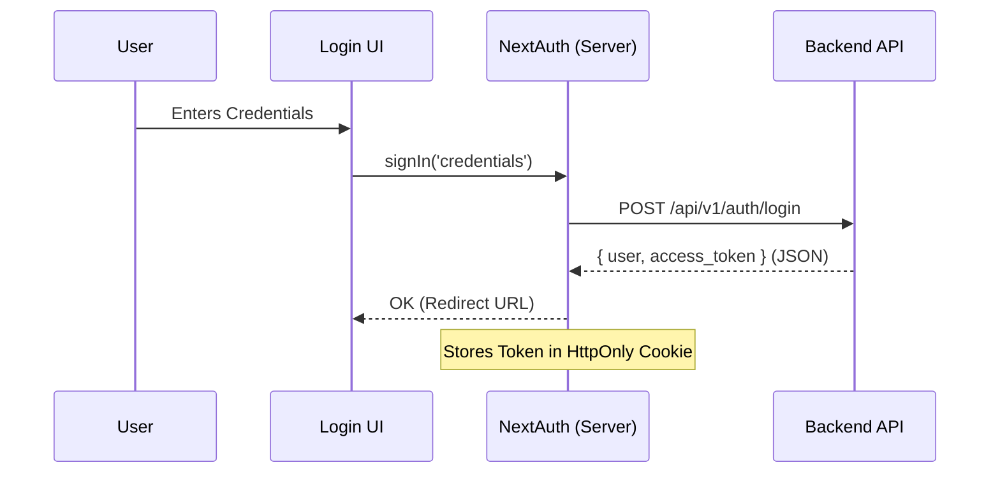

# Service Analysis: Authentication (Auth)

## 1. Executive Summary
The Authentication service is primarily built on **NextAuth.js (v5 Beta)** using the **Credentials** provider. It acts as a proxy between the Next.js frontend and the Backend API.
- **Status**: Functional but contains dead code and UI feedback issues.
- **Critical Finding**: The Login UI does **not** show a loading state during submission due to misuse of hooks.

## 2. Architecture Overview

### Components
- **Frontend**: `src/features/auth/components/LoginForm`
- **Auth Layer**: `src/auth.ts`, `src/auth.config.ts`, `src/middleware.ts`
- **Backend Integration**: `src/features/auth/api/auth-api.ts` (Legacy/Partial), `src/auth.ts` (Active)

### Flow Diagram

## 3. Functional Verification

| Feature | Status | Implementation Details | Issues |
| :--- | :--- | :--- | :--- |
| **Login** | ✅ Functional | Uses `signIn` from `next-auth/react`. | **UI Bug**: Loading spinner never appears (see Findings). |
| **Session** | ✅ Functional | `jwt` strategy with 7-day max age. `client.ts` retrieves token for API calls. | None. |
| **RBAC** | ✅ Functional | Middleware checks `token.role`. `auth.config.ts` handles redirection based on role. | None. |
| **Logout** | ⚠️ Mixed | Logic exists in `authApi.logout` (legacy) and `signOut`. Application likely uses `signOut`. | Verify `signOut` clears backend token if required (stateless JWT might not need this). |
| **Persistence** | ✅ Functional | Tokens persisted in Secure HttpOnly cookies involved in NextAuth session. | None. |

## 4. Key Findings & Issues

### 🔴 [Critical] Broken Loading State in Login Form
**Location**: `src/features/auth/components/login-form.tsx`
**Issue**: The component uses `useLogin()` hook (TanStack Mutation) to get `isPending` state, but it **never calls** the mutation function. Instead, it calls `signIn` directly.
**Result**: `isPending` is always `false`. The "Đang xác thực..." (Authenticating...) state and spinner are **never shown** to the user.
**Fix**: Remove `useLogin` and use `formState.isSubmitting` from `react-hook-form` or a local loading state wrapping `signIn`.

### 🟡 [Warning] Dead/Legacy Code
**Location**: `src/features/auth/api/auth-api.ts`
**Issue**: Contains `login`, `logout` methods calling the backend directly. These are bypassed by NextAuth configuration (`auth.ts`) which calls the backend itself.
**Impact**: Confusing for developers; potential for drift if backend API changes.

## 5. Recommendations

1.  **Fix Login UI**: Refactor `LoginForm` to use `isSubmitting` from `react-hook-form`.
2.  **Cleanup**: Deprecate or remove unused methods in `auth-api.ts` if they are truly superseded by NextAuth.
3.  **Standardize**: Ensure all auth-related actions (like Logout) consistently use NextAuth primitives.
